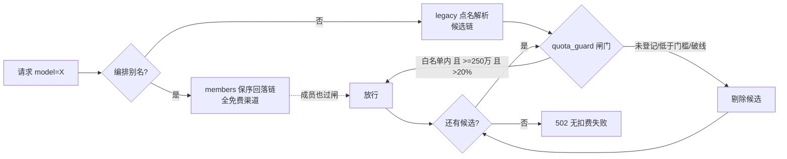

# 网关安全防扣费策略

> 起因：2026-09-22 实测发现点名 `doubao-seed-evolving` 会被路由直打方舟、`doubao-*` 落 zenmux 付费款、`glm-5.3-flash` 落 openrouter 付费款——「意外路由到付费模型」是真实存在的。郭老师指令：额度梳理 / 路由防超额 / 20% 警戒线 / 「必须大于250万才考虑」/ 「一定要检查好，不然乱走模型导致用户扣费」。

## 一、额度警戒闸门（quota_guard）三层防线

代码 `services/quota_guard.py` + 数据 `data/quota_guard.json`（mtime 热加载免重启），在聊天路由 capability/resource 之后、key/配额之前拦截，被拦候选**预过滤剔出回落链**（末位白名单渠道免 3s TTFT 守卫误伤）。

- **第一层 白名单制**：渠道未登记的模型一律拒（fail-safe）；被拦候选直接消失在候选链里
- **第二层 最低额度门槛**：ark 白名单模型总免费额度必须 **≥250 万 token**（郭老师 9-22 定，同日追认 250 万档 V4-Pro 也可以）；低于门槛即使登记也拒
- **第三层 20% 警戒线**：白名单内剩余额度 ≤20% 自动停（deepseek-v4-flash 7.8%/16.9% 已被拦）

## 二、渠道准入矩阵（2026-09-22 现状）

| 渠道 | 策略 | 说明 |
|---|---|---|
| ark（方舟） | 白名单+≥250万+20%线 | 仅 doubao-seed-evolving(550万)、deepseek-v4-pro-ga-260813(250万档) |
| ark-image | 白名单（张计价） | 只放 Seedream-4.5（157/200张）；5.0-pro 无免费额度默认拦 |
| zscc | 白名单 | 只放 deepseek-v4.1-cc（钦定）+ Omni 双席（批准）；其余 96 模型拒 |
| zenmux / openrouter | 每日免费快照白名单 | openrouter 另加 ling 三兄弟无后缀款 |
| ark-coding | **已删除**（9-22 郭老师：不再买） | key+渠道+目录三清，备份 channels_b4_arkcoding_del_20260922.json |
| tokenrhythm / deepseek / zhipu / gmi / bai / volcengine / siliconflow / mistral(chat) | deny_all | 付费/过期/保护余额；siliconflow+mistral 的语音/embedding 端点不受影响 |

## 三、红线与坑册（新 Agent 必读）

1. **付费禁测清单**（探针脚本硬编码）：deepseek、opencode、tokenrhythm、ark-coding（已删）。zscc 也禁主动压测（按量计费）。
2. **密钥永不外泄**：渠道 key 不进 git/记忆文件/Obsidian；`data/` 整体 gitignore。Jev key 在 `data/typesafe_key.txt`。
3. **改 quota_guard.json 必须无 BOM UTF-8**：PowerShell `Set-Content -Encoding UTF8` 带 BOM 会让 json.load 失败静默回退 last-good（用 `[IO.File]::WriteAllText($f,$t,(New-Object Text.UTF8Encoding($false)))` 或 python）。
4. **白名单键=网关真实上游模型名**（ark 是 `deepseek-v4-pro-ga-260813` 这类带日期后缀的），不一致=fail-safe 拒绝（安全方向）。
5. **额度数据保鲜**：ArkQuotaScan 每天 10:17 自动回写；手动刷 = 方舟控制台「开通管理」页对照改 remaining。
6. **网关重启**：普通权限，禁 UAC；以 `netstat -ano | findstr :3100` LISTENING 为准。
7. **观测端点**：`GET :3100/api/quota-guard`（免鉴权）看闸门全貌；`/api/route-log` 查每笔路由落渠。

## 四、验证清单（改闸门后必跑）

- [ ] 白名单模型点名 → 200 正常回答
- [ ] 未登记付费模型点名 → 502 且 route-log 里有 guard_* 记录、上游无调用
- [ ] free-fast / free-balanced / voice-chat 三别名回归 200
- [ ] 生图闸门：无免费额度模型 → 403 拦截
- [ ] /api/quota-guard 看板数据与 guard 文件一致

关联 [[workflow_网关渠道挑选与刷新策略]] [[workflow_调度大脑交接手册]]
