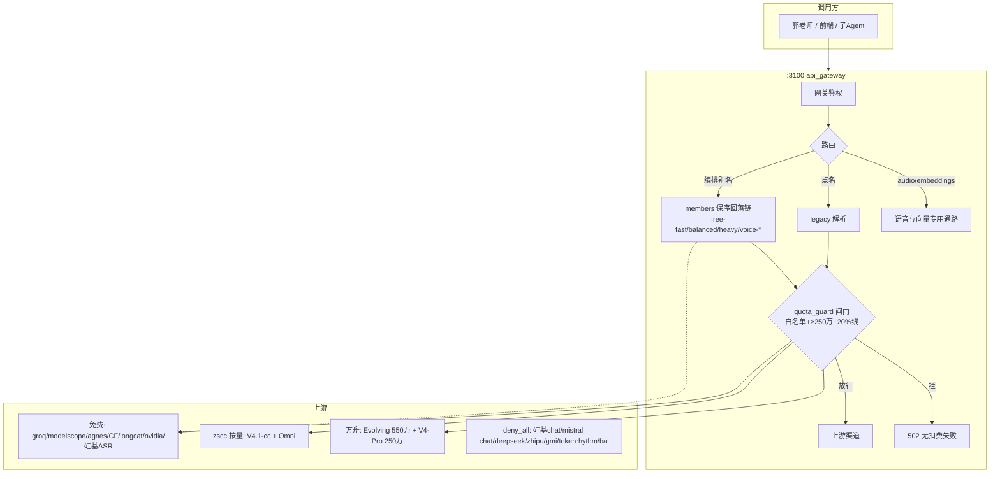
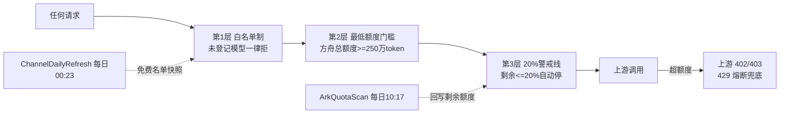
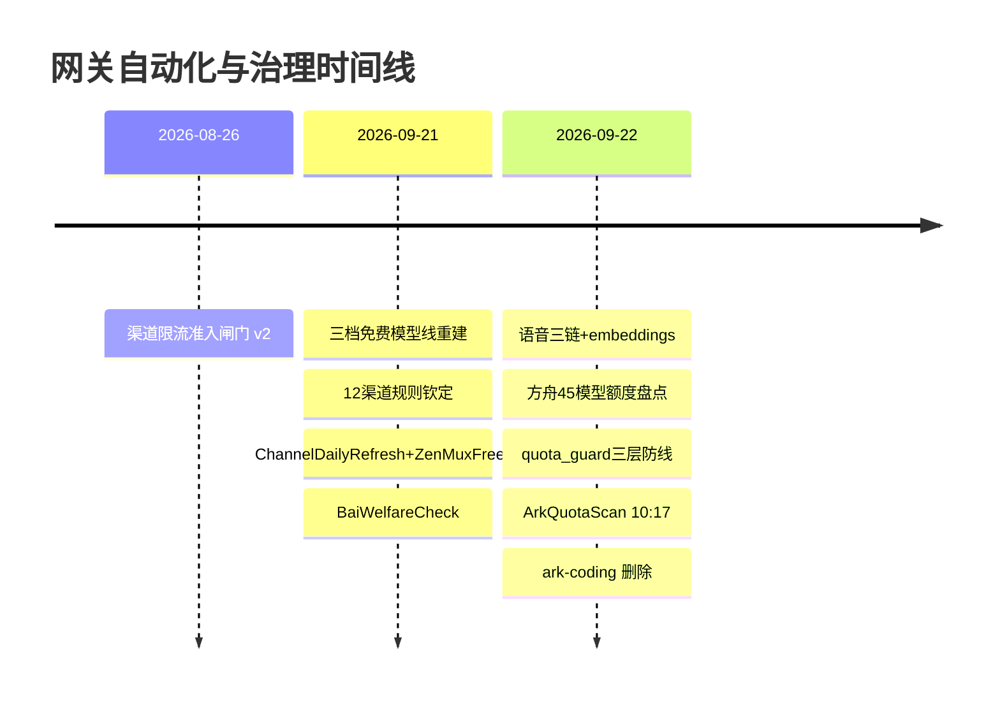

# 网关项目现状与展望（2026-09-22 快照）

## 一、两天战果（9-21~22 大建设）

| 板块 | 战果 |
|---|---|
| 三档免费编排 | free-fast 4 / free-balanced 12 / free-heavy 2，全成员每日实测，能力底线 ≥qwen3.8-27b |
| 语音三链 | voice-asr（6 席全免费）/ voice-tts（mistral→CosyVoice2）/ voice-chat（zscc Qwen3-Omni 双席） |
| 能力端点 | /v1/audio/transcriptions + /v1/audio/speech + /v1/embeddings（硅基 Qwen3-Embedding-8B） |
| 方舟治理 | 免费额度 45 模型盘点入档 + 额度警戒闸门（白名单+≥250万门槛+20%警戒线）+ 每日 10:17 自动盘点 |
| 防扣费体系 | quota_guard 覆盖 ark/zscc/zenmux/openrouter + 8 渠道 deny_all；实测三种拒绝路径全生效 |
| 自动化矩阵 | ChannelDailyRefresh / ZenMuxFreeScan / ArkQuotaScan / BaiWelfareCheck 四任务 |
| 渠道纪律 | 12 渠道规则全部钦定落档；ark-coding 删除（不再续费）；bai 冷宫周探监 |
| 其他 | Sparkle 免重启补丁、Jev 决策模型激活、网关健康缓存性能修复 |

## 二、全景架构图

## 三、防扣费防线图

## 四、自动化时间线

## 五、未来前景（路线候选，待郭老师拍板）

1. **Jev 决策层**（已激活待接）：意图路由自动选档 → 派发中心打分 → 对外「决策即服务」。毫秒级近零成本，注册送 $5 = 1.2 亿 token。
2. **语音助手闭环**：ASR（听）→ voice-chat（想，Omni）→ TTS（说）已在网关齐备，差一个前端入口（可挂在 ai-hub 前端或 dispatch 页）。
3. **RAG 语义检索**：embeddings 端点已就绪，可给 :3000 搜索网关加语义召回（Qwen3-Embedding-8B 4096 维，1.12s/次）。
4. **活动二红利**：方舟协作奖励计划（每日单模型 200 万免费 token）未领取，领取后 Evolving 日额上限可达 750 万/日——需要郭老师到控制台点「立即参与」。
5. **闸门智能化**：quota 记账可从「每日快照」升级为「网关侧 token 记账实时扣减」，彻底消除快照间隔窗口。
6. **nemotron-omni 免费语音对话**：openrouter/nvidia 有免费的 `nemotron-3-nano-omni-30b-a3b`，可加为 voice-chat 免费备席（待拍板）。

## 六、风险登记

- 方舟额度数据靠每日快照，间隔内极端用量可能越过 20% 线才被拦（下日 10:17 才发现）→ 见前景 5
- ArkQuotaScan 依赖 Chrome 开着且方舟控制台登录态；失败会写渠道警报但当天数据不更新
- Sparkle 自更新会冲掉 asar 补丁（更新不重启内核的补丁），冲掉后恢复重启行为
- zscc 按量计费是编排里唯一非免费成员（郭老师钦定），有监控义务

关联 [[workflow_调度大脑交接手册]] [[project_ai_gateway]]
